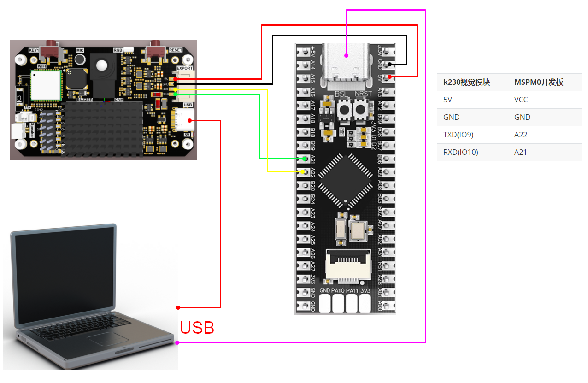
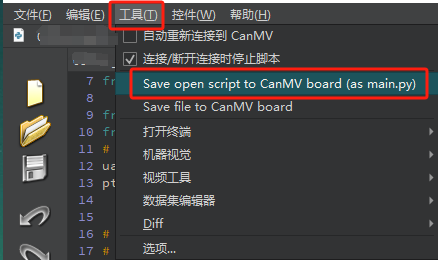
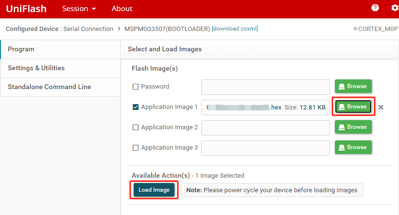
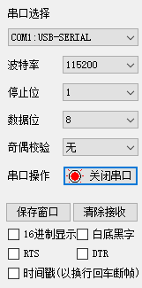
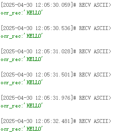

# k230OCR字符识别

[toc]

## k230和MSPM0通信

### 1. 实验前提
本教程使用的是MSPMG3507开发板，对应例程路径为【14.export\MSPM0-K230\13_k230_ocr_rec】。

k230要运行【14.export\CanmvIDE-K230\13.ocr_rec.py】程序才能开始实验，建议下载为离线运行程序。


需要用到的物品：

Windows系统电脑
MSPMG3507开发板
K230视觉模块(包含烧录好镜像的TF卡)
两根type-C数据线
连接线


### 2. 实验接线
| k230视觉模块 | MSPM0开发板 |
| ------------ | ----------- |
| 5V           | VCC         |
| GND          | GND         |
| TXD(IO9)     | A22         |
| RXD(IO10)    | A21         |



### 3. 主要代码讲解
```C
void Pto_Data_Parse(uint8_t *data_buf, uint8_t num)
{
    uint8_t pto_head = data_buf[0];
	uint8_t pto_tail = data_buf[num-1];
    if (!(pto_head == PTO_HEAD && pto_tail == PTO_TAIL))
    {
	    sprintf(print_buf, "pto error:pto_head=0x%02x , pto_tail=0x%02x\n", pto_head, pto_tail);
        uart0_send_string(print_buf);
        return;
    }
    uint8_t data_index = 1;
    uint8_t field_index[PTO_BUF_LEN_MAX] = {0};
    int i = 0;
    int values[PTO_BUF_LEN_MAX] = {0};
    for (i = 1; i < num-1; i++)
    {
        if (data_buf[i] == ',')
        {
            data_buf[i] = 0;
            field_index[data_index] = i;
            data_index++;
        }
    }
    char msg[PTO_BUF_LEN_MAX] = {0};
    for (i = 0; i < data_index; i++)
    {
        if (i == 2)
        {
            memcpy(msg, (char*)data_buf+field_index[i]+1, values[0]-field_index[i]-2);
        }
        else
        {
            values[i] = Pto_Char_To_Int((char*)data_buf+field_index[i]+1);
        }
    }
    
    uint8_t pto_len = values[0];
    
    if (pto_len != num)
    {
        sprintf(print_buf, "pto_len error:%d , data_len:%d\n", pto_len, num);
        uart0_send_string(print_buf);
        return;
    }
    uint8_t pto_id = values[1];
    if (pto_id != PTO_FUNC_ID)
    {
        sprintf(print_buf, "pto_id error:%d, func_id:%d\n", pto_id, PTO_FUNC_ID);
        uart0_send_string(print_buf);
        return;
    }

    sprintf(print_buf, "ocr_rec:'%s'\n", msg);
    uart0_send_string(print_buf);
}
```
以上函数为解析K230数据的函数，只有符合特定协议才可以解析出对应的数据。

其中
- msg：是ocr字符信息。

  


### 4. 实验现象
1. 连接好线后，k230视觉模块脱机运行
    K230连接Canmv IDE后，打开对应程序，点击工具栏的 【Save open script to CanMV board (as main.py)】，然后重启K230。

  

2. MSPM0烧录例程生成的hex文件。



3. 串口助手设置成如图的界面


4. 当K230摄像头画面识别到字符，串口助手就会打印出k230传输给MSPM0的信息。

  - 其中
    - msg：是ocr字符信息。

  如下图所示
  


